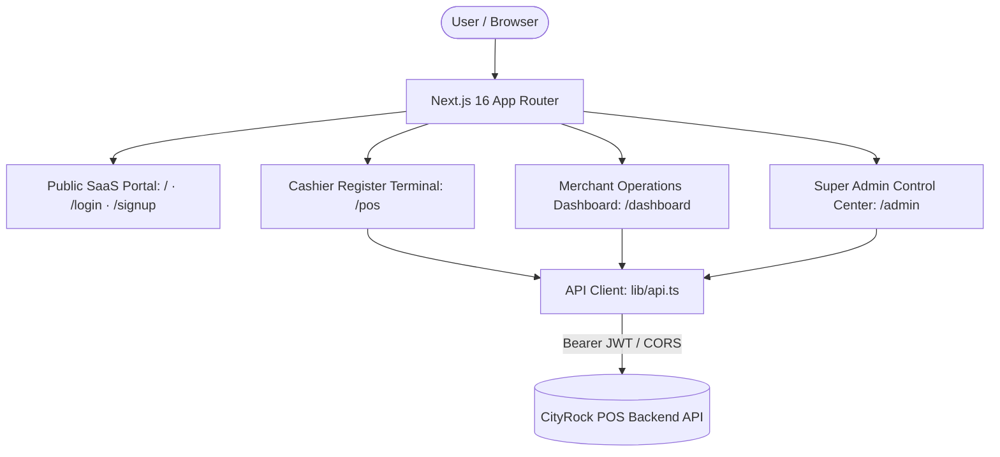

<div align="center">

# 🛍️ CityRock POS — Next.js 16 & React 19 Web Platform

### Enterprise Multi-Tenant Point of Sale, Cashier Terminal & Merchant Cloud Dashboard

[](https://nextjs.org)
[](https://react.dev)
[](https://tailwindcss.com)
[](https://www.typescriptlang.org)
[](https://tanstack.com/query)
[](https://github.com/anzamuneebkhanofficial/cityrock-pos-api)
[](https://vercel.com)

---

### 🔌 Companion Backend API Engine
> **Backend Repository:** **[cityrock-pos-api](https://github.com/anzamuneebkhanofficial/cityrock-pos-api)**  
> This frontend web application is powered by the CityRock POS Express 5, MongoDB, and Mongoose REST API backend engine.

---

</div>

## 📖 Overview

**CityRock POS Web** is an enterprise-grade retail Point of Sale (POS) and SaaS management platform built using the latest **Next.js 16 App Router**, **React 19**, and **Tailwind CSS v4**.

Designed for high speed, physical store durability, and aesthetic clarity, it provides a dedicated full-screen cashier cash register interface, a comprehensive merchant back-office management dashboard, a multi-store switcher, and a global Super Administrator control panel for managing SaaS subscriptions and tenant onboarding.

---

## 🖥️ System Architecture & Portals



---

## 🌟 Key Modules & Features

### 1. 🛒 Ultra-Fast Cashier POS Register (`/pos`)
- **Built for Speed:** Minimalist, distraction-free retail layout with instant search by product name, category, or barcode.
- **Cart Management:** Real-time quantity adjustment, stock threshold validation, discounts, and item tax calculations.
- **Flexible Payments:** Support for Cash, Credit/Debit Card, Bank Transfer, and Split Payment transactions.
- **Receipt & Invoicing:** Immediate modal thermal receipt preview with direct browser print and downloadable PDF invoices.

### 2. 🏬 Merchant Operations Back-Office (`/dashboard`)
- **Inventory & Catalog:** Create, edit, and categorize products, manage stock levels per physical branch, download low-stock alerts, and perform bulk Excel spreadsheet imports/exports.
- **Multi-Store Management:** Store owners can switch between physical outlets on the fly from the top navigation bar.
- **Sales Analytics:** Visual transaction history, itemized refunds/returns processing, and sales filtering by date range or cashier.
- **Customer CRM & Suppliers:** Track repeat customer purchase histories, store credits, supplier purchase orders (PO), and order fulfillment.
- **Team & Permissions:** Invite staff members with granular role assignments (Store Manager, Cashier, Inventory Auditor).
- **Billing & Subscription:** View current plan details, trial countdown, payment history, and upload offline bank transfer payment slips.
- **Support Desk:** Built-in two-way ticket management to communicate directly with platform administrators.

### 3. 👑 Super Administrator Control Center (`/admin`)
- **Platform Analytics:** Global bird's-eye metrics on active tenants, revenue, registered stores, and ticket queues.
- **Tenant Management:** View all registered businesses, alter subscription statuses (Active, Trial, Suspended), and inspect store data.
- **Payment Verification:** Review manual bank transfer receipts uploaded by tenants, with one-click approval or rejection with reason.
- **Plan Manager:** Configure subscription tiers, monthly/annual pricing, and feature quotas.
- **Platform Settings & Branding:** Dynamic platform logo and system-wide branding configuration.

### 4. 🎨 Design Aesthetics & UX
- Powered by **Tailwind CSS v4** with a custom high-contrast dark/light design system.
- Smooth transitions and interactive micro-animations with **Framer Motion**.
- Clean, responsive iconography with **Lucide React**.
- Informative business intelligence charts powered by **Recharts**.
- Instant page transitions with `nextjs-toploader`.

---

## 🛠️ Technology Stack

| Layer | Technology | Details |
| :--- | :--- | :--- |
| **Framework** | Next.js | `16.3.3` (App Router, Turbopack ready) |
| **UI Library** | React | `19.2.8` |
| **Language** | TypeScript | `5.x` |
| **Styling** | Tailwind CSS | `v4` with modern CSS tokens |
| **State & Fetching**| TanStack Query & Axios | `@tanstack/react-query ^5.102.5`, `axios ^1.20.0` |
| **Forms & Validation**| React Hook Form & Zod | `react-hook-form ^7.86.0`, `zod ^4.4.3` |
| **Icons & Motion** | Lucide & Framer Motion | `lucide-react ^1.34.0`, `framer-motion ^13.1.1` |
| **Charts** | Recharts | `recharts ^3.6.0` |
| **Notifications** | React Hot Toast | `react-hot-toast ^2.6.0` |

---

## 📁 Project Directory Structure

```text
frontend/
├── app/
│   ├── (auth)/              # Login, Signup, Forgot/Reset Password, Verify Email
│   ├── admin/               # Super Admin control panel (tenants, payments, plans)
│   ├── dashboard/           # Merchant back-office (inventory, reports, staff)
│   ├── pos/                 # High-speed cashier retail register interface
│   ├── layout.tsx           # Global Root layout (Fonts, Providers, Toaster)
│   ├── page.tsx             # Public SaaS landing page with features & pricing
│   └── globals.css          # Tailwind CSS v4 design tokens and utilities
├── components/
│   ├── admin/               # Admin panel widgets and tables
│   ├── dashboard/           # Store selector, navigation, stats widgets
│   ├── pos/                 # POS cart, product grid, checkout modal, receipt
│   └── ui/                  # Reusable accessible UI components (buttons, modals, badges)
├── lib/
│   └── api.ts               # Axios client instance with JWT interceptor & typed API SDK
├── public/                  # Static assets, branding, and robots.txt
├── .env.example             # Documented frontend environment template
├── next.config.ts           # Next.js configuration & image whitelisting
└── package.json             # Dependencies and scripts
```

---

## ⚙️ Environment Variables

Copy `.env.example` to `.env.local` for local development:

```bash
cp .env.example .env.local
```

### Configuration Keys:

| Variable | Description | Example / Production Value |
| :--- | :--- | :--- |
| `NEXT_PUBLIC_API_URL` | Full URL to the Backend API (including `/api/v1`) | `https://cityrock-pos-api.vercel.app/api/v1` |
| `NEXT_PUBLIC_BACKEND_URL` | Root URL of Backend (for media & health checks) | `https://cityrock-pos-api.vercel.app` |

> **Important:** Next.js embeds variables starting with `NEXT_PUBLIC_` into the client-side JavaScript bundle during build time. Make sure these are set in Vercel before triggering a deployment.

---

## 🚀 Getting Started

### Prerequisites
- **Node.js** >= 20.0.0
- **npm** or **pnpm**
- Running instance of **[cityrock-pos-api](https://github.com/anzamuneebkhanofficial/cityrock-pos-api)** (Local or Cloud)

### Step-by-Step Installation

```bash
# 1. Clone the repository
git clone https://github.com/anzamuneebkhanofficial/cityrock-pos-web.git
cd cityrock-pos-web

# 2. Install dependencies
npm install

# 3. Setup environment variables
cp .env.example .env.local
# Ensure NEXT_PUBLIC_API_URL points to your backend instance

# 4. Run the development server
npm run dev

# 5. Open your browser:
# Main Landing & Login: http://localhost:3000
# Cashier POS Interface: http://localhost:3000/pos
# Merchant Dashboard:   http://localhost:3000/dashboard
```

---

## 🌐 Production Deployment on Vercel

The frontend is natively optimized for deployment on [Vercel](https://vercel.com):

1. Log in to **Vercel** and click **Add New... > Project**.
2. Import the `cityrock-pos-web` repository.
3. In Project Configuration:
   - **Framework Preset:** Vercel automatically selects **Next.js**.
   - **Root Directory:** `./`
4. Expand **Environment Variables** and add:
   - `NEXT_PUBLIC_API_URL` = `https://your-backend-domain.vercel.app/api/v1`
   - `NEXT_PUBLIC_BACKEND_URL` = `https://your-backend-domain.vercel.app`
5. Click **Deploy**. Vercel will build the application and provide a global CDN production URL.

---

## 🔗 Related Projects

- **Backend API Repository:** [cityrock-pos-api](https://github.com/anzamuneebkhanofficial/cityrock-pos-api) (Express 5, MongoDB, Node.js 20+)

---

## 📄 License
Proprietary — All rights reserved by **CityRock POS**.
